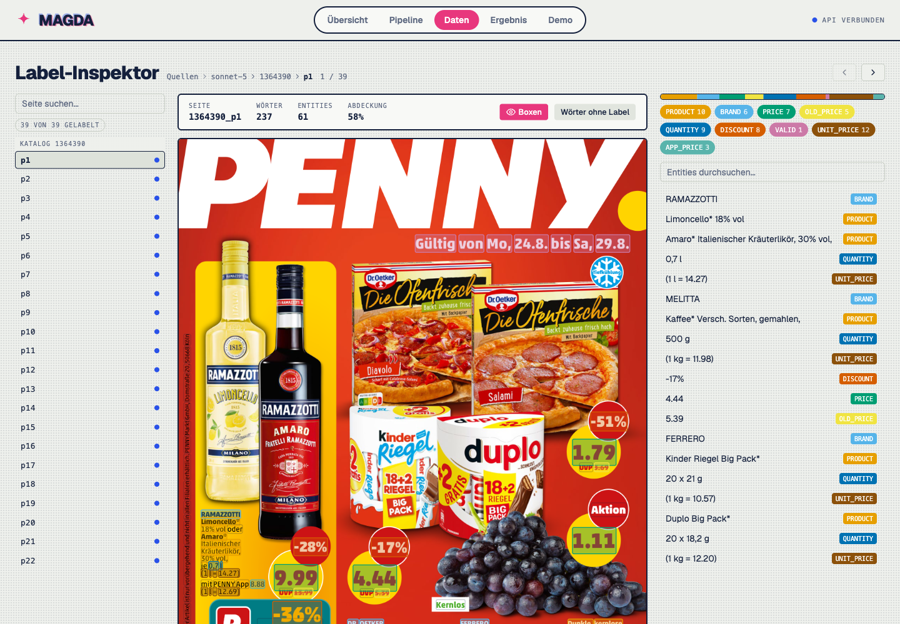
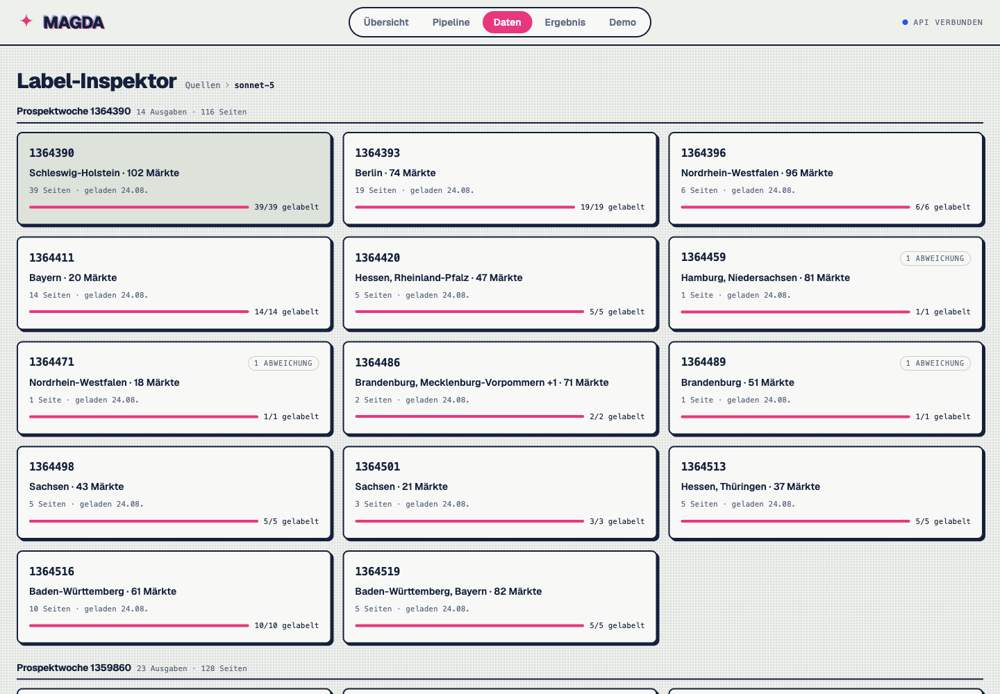

# Magda

**Strukturierte Angebote aus PENNY-Prospekten.** Selbst trainierte Modelle erkennen
Produkte, Marken und Preise; ein Paarmodell ordnet sie zu Angeboten zu.
Die Weboberfläche zeigt Daten, Annotationen und Modellvergleiche.

Semesterprojekt · Information Extraction · Leuphana · SoSe 2026

Bogdan Roth · Kjell Lavezzari · Noah Samel



## Starten

Python ab 3.11 und Node.js ab 22.12 mit npm. Befehle aus dem Projektroot ausführen:

```bash
git clone https://github.com/noahsa16/magda.git
cd magda
python3 -m venv .venv
.venv/bin/python -m pip install -e '.[dev]'
npm --prefix frontend ci
.venv/bin/magda serve --frontend
```

Oberfläche: [localhost:5173](http://localhost:5173).
Vorhandene Daten und Ergebnisse lassen sich ohne API-Key ansehen.
Neue PDF-Auswertungen benötigen die trainierten Modelle.



## Ergebnisse reproduzieren

Wortlisten, Labels, feste Splits, menschliche Referenzen und gespeicherte
Vorhersagen liegen bei. Den späteren Qwen-Vergleich gegen die menschliche
Referenz und Magdas gespeicherte Ausgabe nachrechnen, ohne API oder Modellgewichte:

```bash
.venv/bin/python scripts/score_runtime_offers.py \
  data/eval/runtime_thl_qwen3.8-27b_2026-09-24.json \
  --output /tmp/magda-qwen-score.json
```

[Reproduktionsanleitung](docs/report/README.md): Hauptstudie, Astra-Vergleich,
Tabellen und LaTeX-Bericht. Die vollständige Neuberechnung der Gruppierung
benötigt den ursprünglichen Paarmodell-Checkpoint vom Team. Für Training und
neue Inferenz sind weitere Modellgewichte bzw. Seitenbilder nötig:
[Rohdaten](docs/archive/README.md) · [GPU-Setup](docs/runpod.md).
Referenzlabels und Splits für die Reproduktion unverändert lassen.

[Studienergebnisse](data/eval/study-2026-09-16/report.md) ·
[Bewertungsprotokoll](docs/evaluation-protocol.md) ·
[Proposal](docs/proposal/IE_ProjectProposal_Magda.pdf)

Tests: `.venv/bin/python -m pytest` und `npm --prefix frontend test`.
